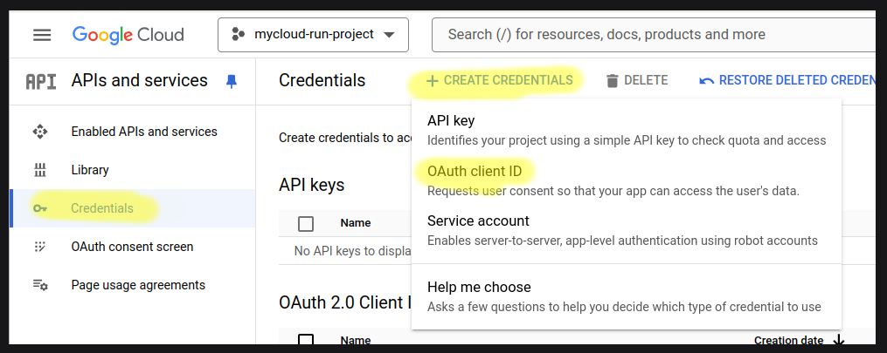
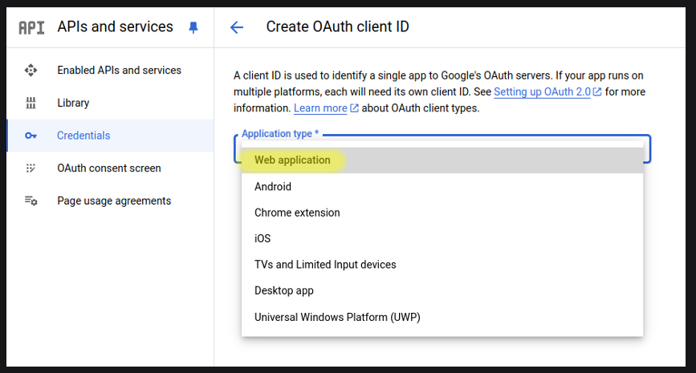
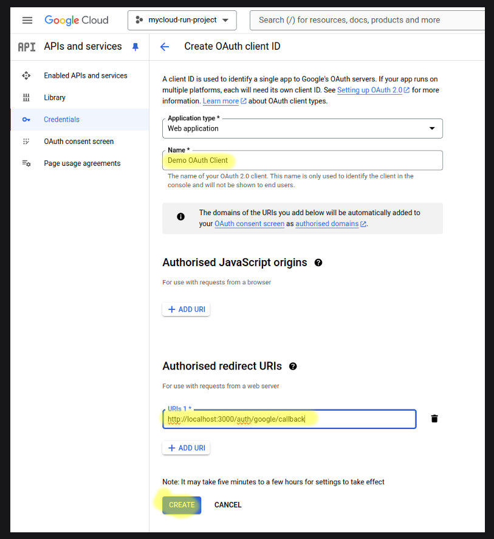
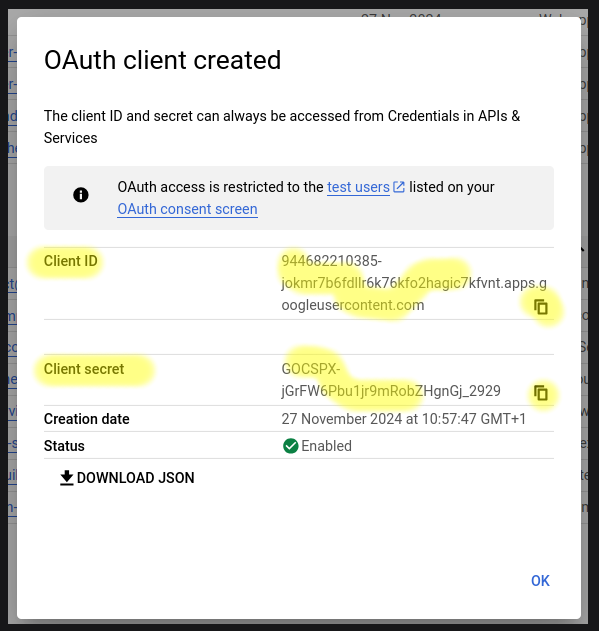
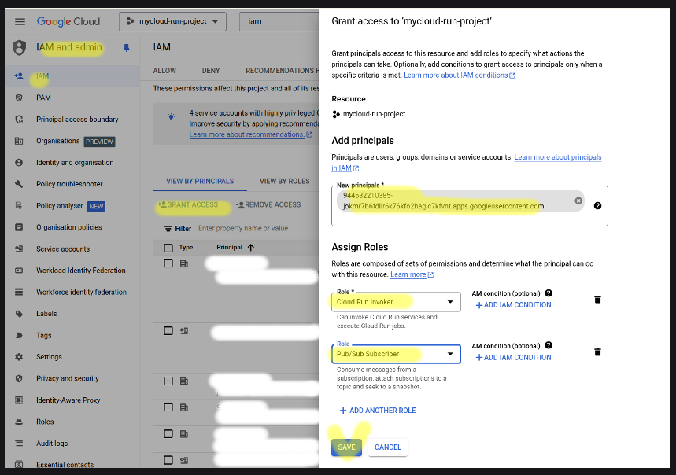
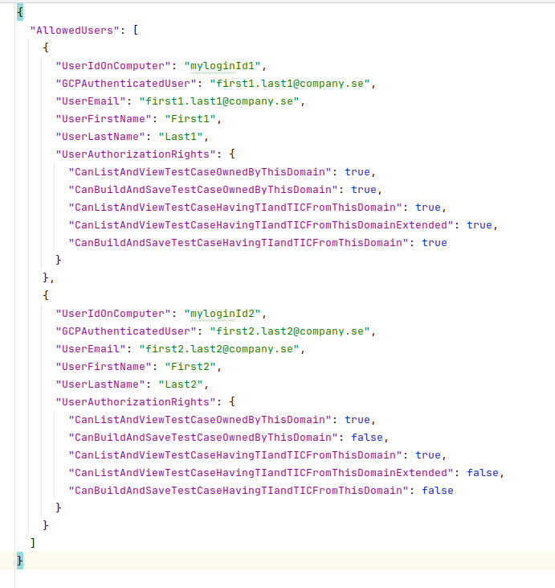
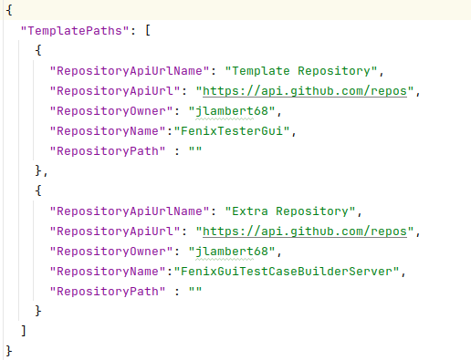
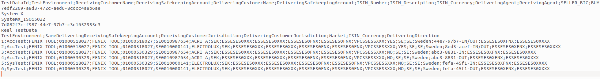

MIT License

Copyright (c) 2024 Jonas Lambert

Permission is hereby granted, free of charge, to any person obtaining a copy of this software and associated documentation files (the "Software"), to deal in the Software without restriction, including without limitation the rights to use, copy, modify, merge, publish, distribute, sublicense, and/or sell copies of the Software, and to permit persons to whom the Software is furnished to do so, subject to the following conditions:

The above copyright notice and this permission notice shall be included in all copies or substantial portions of the Software.

THE SOFTWARE IS PROVIDED "AS IS", WITHOUT WARRANTY OF ANY KIND, EXPRESS OR IMPLIED, INCLUDING BUT NOT LIMITED TO THE WARRANTIES OF MERCHANTABILITY, FITNESS FOR A PARTICULAR PURPOSE AND NONINFRINGEMENT. IN NO EVENT SHALL THE AUTHORS OR COPYRIGHT HOLDERS BE LIABLE FOR ANY CLAIM, DAMAGES OR OTHER LIABILITY, WHETHER IN AN ACTION OF CONTRACT, TORT OR OTHERWISE, ARISING FROM, OUT OF OR IN CONNECTION WITH THE SOFTWARE OR THE USE OR OTHER DEALINGS IN THE SOFTWARE.

***

# Fenix Inception

## External Connector
A External Connector is the component that has two main purpose. First of all do it expose the TestInstructions and TestInstructionContainers that is supported by the external TestAuto framwork. The other important task for the External Connector is to act as the bridge between the Fenix Inception world in GCP and the external TestAuto framework. 

The following environment variables are needed for the Connector to be able to run. The setup is done to be able to run this and other Fenix Inception component locally but using certain GCP service, i.e. database, pub/sub...

| Environment variable                                                                  | Example value                                                            | comment |
|---------------------------------------------------------------------------------------|--------------------------------------------------------------------------|---------|
| AuthClientId                                                                          | 944682210385-jokmr7b6fdllr6k76kfo2hagic7kfvnt.apps.googleusercontent.com |         |
| AuthClientSecret                                                                      | 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                                      |         |
| ENVIRONMENT                                                                           | dev                                                                      |         |
| ExecutionConnectorPort                                                                | 6673                                                                     |         |
| ExecutionLocationForConnector                                                         | LOCALHOST_NODOCKER                                                       |         |
| ExecutionLocationForWorker                                                            | LOCALHOST_NODOCKER                                                       |         |
| ExecutionWorkerAddress                                                                | 127.0.0.1                                                                |         |
| ExecutionWorkerPort                                                                   | 6671                                                                     |         |
| ForceNewBaseLineForTestInstructionsAndTestInstructionContainers                       | true                                                                     |         |
| GCPAuthentication                                                                     | true                                                                     |         |
| GcpProject                                                                            | mycloud-run-project                                                      |         |
| GenerateNewPrivateKeyForAcc                                                           | false                                                                    |         |
| GenerateNewPrivateKeyForDev                                                           | false                                                                    |         |
| GitHubApiKeys                                                                         | lsk_66asdasKJHGSDksa89asdaKJ800u5a                                       |         |
| LocalServiceAccountPath                                                               | #                                                                        |         |
| LocalWebServerAddress                                                                 | 127.0.0.1                                                                |         |
| LocalWebServerPort                                                                    | 8080                                                                     |         |
| LoggingLevel                                                                          | DebugLevel                                                               |         |
| PrivateKey                                                                            | 0q9werq0w9nOIOISODisd09ASd8kLUOSIDU                                      |         |                                               |
| ProxyServerURL                                                                        | #                                                                        |         |
| RelativePathToAllowedUsersList                                                        | allowedUsers/allowedUsers.json                                           |         |
| ShouldProxyServerBeUsed                                                               | false                                                                    |         |
| ShouldPubSubReceiverBeStarted                                                         | true                                                                     |         |
| TestApiEngineAddress                                                                  | 127.0.0.1                                                                |         |
| TestApiEnginePort                                                                     | 5000                                                                     |         |
| TestApiEngineUrlPath                                                                  | /TestCaseExecution/ExecuteTestActionMethod                               |         |
| TestInstructionExecutionPubSubTopicBase                                               | ProcessTestInstructionExecutionRequest                                   |         |
| ThisConnectorIsTheOneThatPublishSupportedTestInstructionsAndTestInstructionContainers | true                                                                     |         |
| ThisDomainsUuid                                                                       | 7edf2269-a8d3-472c-aed6-8cdcc4a8b6ae                                     |         |
| ThisExecutionDomainUuid                                                               | 7edf2269-a8d3-472c-aed6-8cdcc4a8b6ae                                     |         |
| TurnOffAllCommunicationWithWorker                                                     | false                                                                    |         |
| UseInternalWebServerForTestInsteadOfCallingTestApiEngine                              | true                                                                     |         |
| UseNativeGcpPubSubClientLibrary                                                       | true                                                                     |         |
| UsePubSubToReceiveMessagesFromWorker                                                  | true                                                                     |         |
| UseServiceAccount                                                                     | true                                                                     |         |
| ExecutionEnvironmentPlatform                                                          | Other                                                                    |         |

### AuthClientId and AuthClientSecret
To create the AuthClientId and AuthClientSecret, follow the steps below to produce them in GCP

## Dynamic data
There are some data that is including when building a Connector. They are Allowed Users, Template address together with read key and TestData.

### Allowed Users
Allowed users are specified in a json-file called 'allowedUsers.json' and is placed in the 'allowedUsers' folder, see environment variable 'RelativePathToAllowedUsersList'

Each user need to have the following information set to be able to use Fenix Inception

| User parameter                                             | Description                                                                                                                                    | Possible values |
|------------------------------------------------------------|------------------------------------------------------------------------------------------------------------------------------------------------|-----------------|
| UserIdOnComputer                                           | The users login name on the computer                                                                                                           |                 |
| GCPAuthenticatedUser                                       | The users e-mail used when logging into GCP                                                                                                    |                 |
| UserEmail                                                  | Users e-mail address                                                                                                                           |                 |
| UserFirstName                                              | Users first name                                                                                                                               |                 |
| UserLastName                                               | Users last name                                                                                                                                |                 |
| CanListAndViewTestCaseOwnedByThisDomain                    | Can the user List or View TestCases owned by the Domain that the Connector belongs to.                                                         | true or false   |
| CanBuildAndSaveTestCaseOwnedByThisDomain                   | Can the user build and save a TestCase that is owned by the Domain that the Connector belongs to.                                              | true or false   |
| CanListAndViewTestCaseHavingTIandTICFromThisDomain         | Can the user List or View TestCases having individual TestInstructions, in the TestCase, owned by the Domain that the Connector belongs to.    | true or false   |
| CanListAndViewTestCaseHavingTIandTICFromThisDomainExtended | Not used                                                                                                                                       | true or false   |
| CanBuildAndSaveTestCaseHavingTIandTICFromThisDomain        | Can the user build and save a TestCase having individual TestInstructions, in the TestCase, owned by the Domain that the Connector belongs to. | true or false   |

### Template information
Fenix Inception support the use of templates which content are updated during execution. There are two basic types that can be changed, TestData and Function values.
TesterGui, the client used by the Testers need to know from where to load available Template. 

Github is used for storing Templates so the Connector need to publish address, path and 'read-key' to Fenix. 
The read-key to be used is stored as an environment variable, 'GitHubApiKeys'. If there are more repositories the keys are stored with a space between the keys in the  environment variable.

The rest of the template data is stored in the json-file 'templateUrlparameters.json' in the 'templateUrlparameters-folder'

Each Template repository needs the following information

| Template parameter   | Description                                     | Possible values |
|----------------------|-------------------------------------------------|-----------------|
| RepositoryApiUrlName | A name for this Template repository             |                 |
| RepositoryApiUrl     | The base url to the Github instance             |                 |
| RepositoryOwner      | The repository owner                            |                 |
| RepositoryName       | The repository name                             |                 |
| RepositoryPath       | A repository path under the the repository name | Can be empty    |

### TestData
Fenix Inception supports multiple TestData-set published from each system (Connector). Each TestData-set is stored as a semicolon-separated file with a "special" structure for some extra informaiton

| Row | Description                | Value                                                                      |
|-----|----------------------------|----------------------------------------------------------------------------|
| 1   | Columns Header             | ColumnHeader_1;ColumnHeader_2;ColumnHeader_3;ColumnHeader_4;ColumnHeader_5 |
| 2   | Unique Guid:               | Domain_GUID_Indentifier                                                    |
| 3   | Name                       | Domain_Name                                                                |
| 4   | DataArea Name:             | Domain_TestArea_DataName                                                   |
| 5   | DataArea Guid              | Domain_TestArea_GUID_Indentifier                                           |
| 6   | Gui name for TestArea      | GUI_Name_For_Test_Area                                                     |
| 7   | Columns used in Gui filter | ColumnHeader_1;ColumnHeader_4;ColumnHeader_5                               |
| 8   | Data row                   | Value1b;Value2b;Value3b;Value4b;Value5b                                    |
| ... |                            |                                                                            |
| n   | Data row                   | Value1d;Value2d;Value3d;Value4d;Value5d;                                   |

Below is a real example

